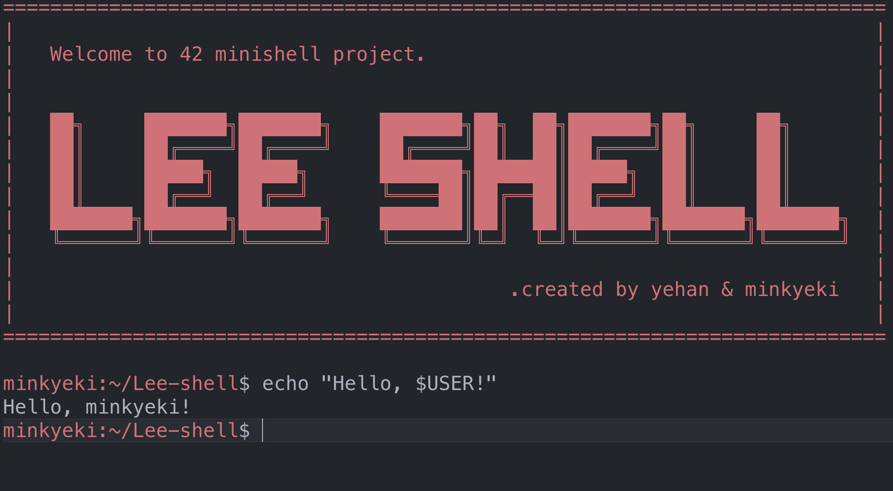

# The objective of this project is to create a simple shell.



## Compile & Run

```bash
cd ./Lee-shell  
make             #1) compile Lee-shell

./lesh           #2) run shell program
```

## 추가 예정. (설명 추가)

- [ ]  Parsing : Abstract Syntax Tree
- [ ]  Word-expansion
